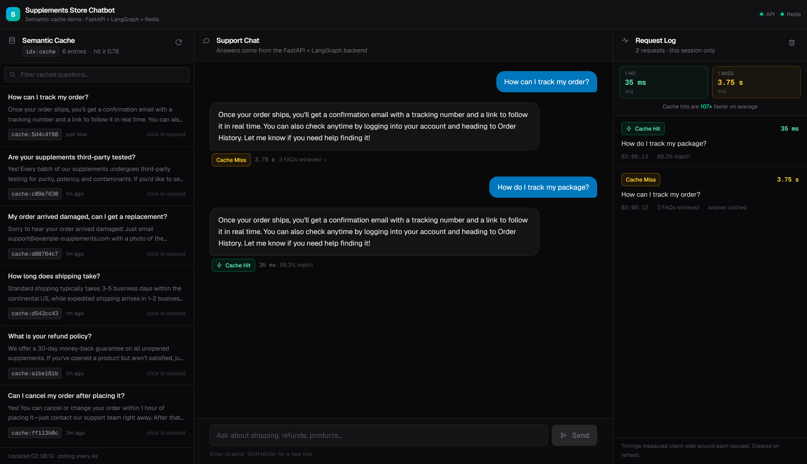
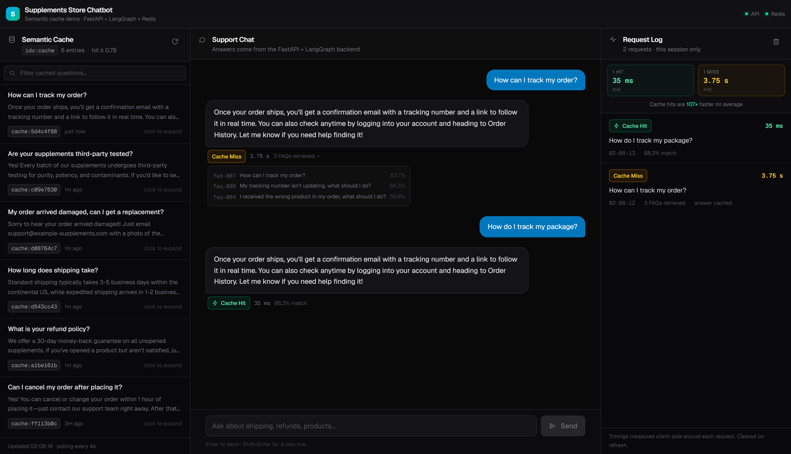
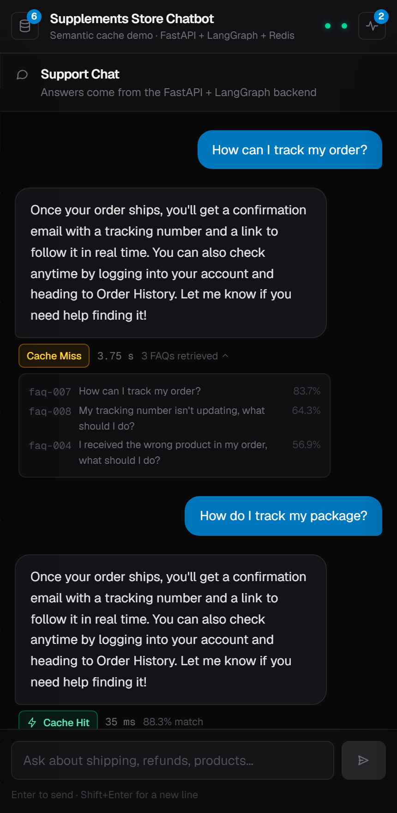
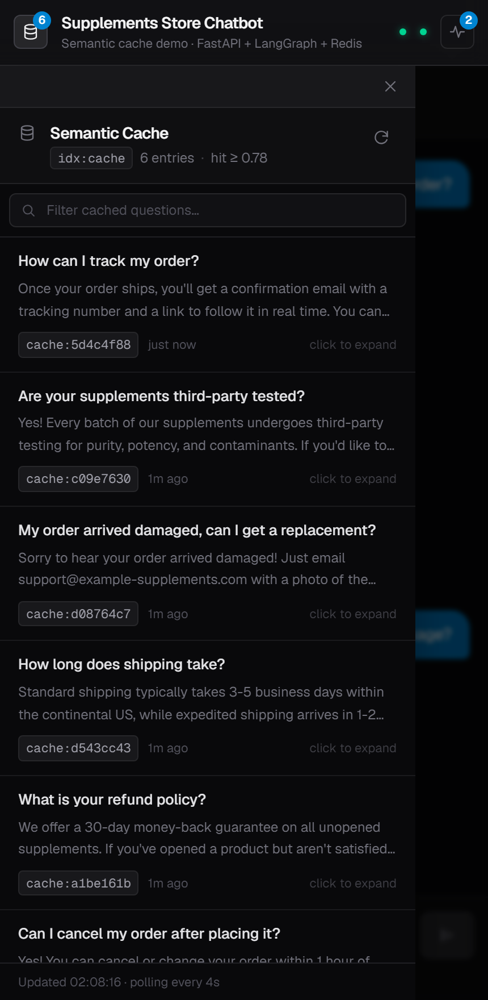

# Supplements Store Chatbot

An e-commerce support chatbot built around a **semantic cache**: questions that
*mean* the same thing as one already answered are served straight from Redis,
without ever reaching the LLM.

FastAPI + LangGraph backend, local open-source embeddings, Redis Stack for vector
search, and a Next.js frontend whose whole job is to make the caching behaviour
visible while you use it.



*A real session. The first question misses the cache and takes **3.75 s** (KB
retrieval + LLM). The reworded follow-up — "order" became "package" — matches the
cached entry at **88.3%** similarity and returns in **35 ms**.*

## What this project demonstrates

- **Vector search as a caching layer**, not just retrieval — embed the question,
  KNN against previously-answered questions, serve on a similarity threshold.
- **A graph-structured LLM workflow** (LangGraph) where the cache check is a
  routing decision that can skip the expensive branch entirely.
- **RAG done properly** on the miss path: KNN over a FAQ knowledge base supplies
  grounded context before generation.
- **Two interchangeable LLM backends** behind one interface — hosted OpenAI or a
  local OpenAI-compatible server — swapped with a single import.
- **A frontend that explains the system it's talking to**, surfacing hit/miss,
  similarity scores, response times, and the live contents of the cache index.
- **No API cost for embeddings.** `BAAI/bge-base-en-v1.5` runs locally via
  `sentence-transformers`; only the generation step calls out.

## Architecture

```
  Browser — three-panel UI  (:3000)
      │
      │  same-origin fetch only
      ▼
  Next.js Route Handlers ─────────────────► Redis   FT.SEARCH idx:cache
      │                                             (feeds the cache panel)
      │  POST /chat  (:8000)
      ▼
  FastAPI ──► LangGraph workflow
                  │
                  ├─ check_cache ────────► Redis   KNN 1 over idx:cache
                  │       │
                  │       ├─ hit  ──► return the stored answer      ~35 ms
                  │       │
                  │       └─ miss ──► retrieve_context ──► Redis   KNN 3 over idx:kb
                  │                   generate_answer   ──► LLM
                  │                   save_cache        ──► Redis   new cache:<uuid>
                  ▼                                                 ~3.75 s
          { answer, is_cached, cache_similarity, sources }
```

The browser never talks to FastAPI or Redis directly. The backend registers no
CORS middleware, so every call is proxied server-side through Next.js — which
also keeps the Redis connection string out of the client bundle.

## The core process

Every question takes one of two paths, and the UI labels which one it took.

### Cache hit — the fast path

```
question ──► embed (local) ──► KNN 1 over idx:cache
                                          │
                                    similarity ≥ 0.78?
                                          │ yes
                                    return stored answer      ~35 ms total
```

No knowledge-base lookup, no LLM call, no new cache write. `sources` comes back
empty precisely because retrieval was skipped.

### Cache miss — the full path

```
question ──► embed ──► KNN 1 over idx:cache ──► below threshold
                                                     │
                              KNN 3 over idx:kb ─────┘        (grounding)
                                     │
                              LLM generate_answer              (the slow part)
                                     │
                              save cache:<uuid> + EXPIRE 24h   ~3.75 s total
```

The answer is written back as a new `cache:<uuid>` document, so the *next*
semantically similar question takes the fast path.

<details>
<summary><b>Screenshot: the retrieved FAQs behind a cache miss</b></summary>

Expanding "3 FAQs retrieved" shows the actual KNN results from `idx:kb` with
their similarity scores — the grounding context the LLM was given.



</details>

## Why this is worth caching

Measured on this machine, local LLM backend, from the request log above:

| | Response time | LLM call | KB lookup |
|---|---|---|---|
| Cache miss | **3.75 s** | yes | yes (KNN 3) |
| Cache hit | **35 ms** | no | no |

Roughly **100× faster**, and every hit is a generation request that never
happened. On a real support bot — where a long tail of customers ask the same
dozen questions in different words — that is the difference between paying per
answer and paying per *distinct* answer.

### The threshold is a real tradeoff

`CACHE_SIMILARITY_THRESHOLD = 0.78` is a tuned guess, and it is wrong in both
directions. Measured against `BAAI/bge-base-en-v1.5`:

| Pair | Similarity | Outcome |
|---|---|---|
| "How can I track my order?" → "How do I track my package?" | 0.883 | hit ✅ |
| "Can I cancel my order after placing it?" → "How do I cancel an order I just placed?" | 0.947 | hit ✅ |
| "What is your refund policy?" → "Can I get my money back on an unopened tub?" | 0.673 | **miss** — a fair paraphrase that re-runs the LLM |
| "How long does shipping take?" → "How much does shipping cost?" | 0.809 | **hit** — but these are different questions |

That last row is the dangerous one: with "How long does shipping take?" already
cached, asking about shipping *cost* scores 0.809 and gets served the *delivery
time* answer. Raising the threshold fixes it and costs
recall; lowering it does the reverse. The honest summary is that a single global
cosine threshold cannot separate "reworded" from "related", and a production
system would want a re-ranking or verification step on top.

## Tech stack

**Backend**

- **FastAPI** — HTTP API, served docs at `/docs`
- **LangGraph** — orchestrates: check cache → (miss) retrieve context → generate answer → save to cache
- **OpenAI-compatible chat** — either hosted OpenAI (`gpt-4o-mini`, `app/llm.py`)
  or a local OpenAI-compatible server (`app/llm_local.py`); see
  [Chat backends](#chat-backends-hosted-openai-vs-local)
- **sentence-transformers** — `BAAI/bge-base-en-v1.5` (local, open-source, no API cost) for embeddings
- **Redis Stack** (RedisJSON + RediSearch) — knowledge base storage, vector search, and semantic cache
- **Pydantic** — request/response schemas (`app/schemas.py`) and settings (`app/config.py`)

**Frontend** (`frontend/`)

- **Next.js 16** (App Router) + **React 19** + **TypeScript**
- **Tailwind CSS v4**
- **node-redis 6** — read-only `FT.SEARCH` against `idx:cache` from a Route Handler

## Frontend

A three-panel dashboard. Each panel answers a different question about what the
system just did.

| Panel | Shows | Source |
|---|---|---|
| **Left** — Semantic Cache | Every `cache:*` entry: question, stored answer, key, age | `FT.SEARCH idx:cache`, polled every 4s |
| **Middle** — Support Chat | The conversation, with a hit/miss badge, timing and similarity under each answer | `POST /chat` via a proxy route |
| **Right** — Request Log | One row per request: hit/miss, response time, similarity, timestamp | Client-side session state |

Design notes worth calling out:

- **The cache panel polls**, so answers cached by *another* session — or by a
  previous run, since entries live 24h — appear without a refresh. During a demo
  you can watch a new entry appear the instant a miss is answered.
- **Response time is measured in the browser**, around the `fetch`, because the
  backend returns no timing field. The request log's "107× faster" line is
  computed from those measurements.
- **Cache entries carry no timestamp** — the stored document is
  `{query, answer, embedding}` and nothing else — so "1m ago" is derived from the
  key's remaining TTL against `CACHE_TTL_SECONDS`.
- **The request log is deliberately ephemeral.** No polling, no log endpoint, no
  persistence; it is session state and clears on refresh.
- **Degraded states are explicit.** Redis unreachable, `idx:cache` not created
  yet, backend down, and LLM unreachable each produce a specific message rather
  than a generic error.

### Responsive

Three columns on desktop; below `lg` the chat goes full-width and the side panels
become drawers, each with a badge showing its item count.

| Chat | Cache drawer |
|---|---|
|  |  |

Full frontend documentation, including the API contract it is built against, is
in [`frontend/README.md`](frontend/README.md).

## Redis data model

Two RedisJSON collections, each with its own RediSearch vector index.

### 1. Knowledge base — `kb:<id>`

```json
// key: kb:faq-005
{
  "id": "faq-005",
  "category": "shipping",
  "question": "How much does shipping cost?",
  "answer": "Standard shipping is free on all orders over $50. ...",
  "embedding": [0.0123, -0.0456, ...]   // 768 floats, BAAI/bge-base-en-v1.5
}
```

Index `idx:kb` (`FT.CREATE idx:kb ON JSON PREFIX 1 kb: SCHEMA ...`):

| JSON path       | Alias       | Type              |
|------------------|-------------|-------------------|
| `$.question`     | `question`  | TEXT              |
| `$.answer`       | `answer`    | TEXT              |
| `$.category`     | `category`  | TAG               |
| `$.embedding`    | `embedding` | VECTOR (HNSW, COSINE, DIM 768, FLOAT32) |

On every question, the workflow embeds the question and runs a `KNN 3`
query against `idx:kb` to pull the 3 most relevant FAQs as context for the LLM.

### 2. Semantic cache — `cache:<uuid>`

```json
// key: cache:1f2e3d4c-...
{
  "query": "how long till my refund shows up",
  "answer": "Once we receive and inspect your return, refunds are processed within 3-5 business days...",
  "embedding": [0.0231, -0.0198, ...]
}
```

Index `idx:cache` (same shape as `idx:kb`, over the `cache:` prefix):

| JSON path     | Alias    | Type                                      |
|----------------|----------|--------------------------------------------|
| `$.query`      | `query`  | TEXT                                       |
| `$.answer`     | `answer` | TEXT                                       |
| `$.embedding`  | `embedding` | VECTOR (HNSW, COSINE, DIM 768, FLOAT32) |

Every `cache:*` key gets a Redis `EXPIRE` set to `CACHE_TTL_SECONDS`
(default 24h), so entries age out on their own — no separate cleanup job.
Because RediSearch keeps its index in sync with keyspace expirations, an
expired entry simply stops showing up in KNN results.

**Cache lookup logic:** embed the incoming question, run `KNN 1` against
`idx:cache`, convert the returned cosine distance to a similarity
(`1 - score`), and treat it as a hit only if `similarity >=
CACHE_SIMILARITY_THRESHOLD` (default `0.78`, calibrated for
`BAAI/bge-base-en-v1.5` — its cosine similarities run lower than OpenAI's for
same-topic paraphrases, so this threshold is model-dependent; re-tune it if
you swap embedding models). This is what makes it a
*semantic* cache — "how long till my refund shows up" can hit a cache
entry saved for "How long does it take to get my refund?" even though the
wording differs.

## Workflow (LangGraph)

```
START -> check_cache --(hit)--> END
             |
          (miss)
             v
      retrieve_context -> generate_answer -> save_cache -> END
```

1. **check_cache** — embed the question, KNN search `idx:cache`. On a hit,
   set `is_cached=True`, log `CACHE HIT`, and route straight to `END`.
2. **retrieve_context** (miss only) — KNN search `idx:kb` for the top-K
   relevant FAQs.
3. **generate_answer** — call the LLM with the FAQ context + question.
4. **save_cache** — embed the question again and store `{query, answer,
   embedding}` under a fresh `cache:<uuid>` key with a TTL. Logs `CACHE
   MISS / NOT CACHED`.

The API response always includes `is_cached: true/false` (see
`app/schemas.py::ChatResponse`).

## API

`POST /chat`

```jsonc
// request
{ "question": "How do I track my package?" }

// response
{
  "answer": "Once your order ships, you'll get a confirmation email...",
  "is_cached": true,          // hit/miss flag the UI badges directly
  "cache_similarity": 0.883,  // non-null only on a hit
  "sources": []               // populated only on a miss — a hit skips KB retrieval
}
```

`GET /health` → `{"status": "ok"}`. No authentication; this is a local demo.

## Chat backends: hosted OpenAI vs. local

Only the `generate_answer` step calls an LLM (embeddings are already local).
There are two interchangeable modules for it, with an identical public
surface — `SYSTEM_PROMPT` and `generate_answer(question, context)`:

| Module             | Talks to                                     | Model setting                    |
|--------------------|----------------------------------------------|----------------------------------|
| `app/llm.py`       | hosted OpenAI (`api.openai.com`)             | `CHAT_MODEL` (`gpt-4o-mini`)     |
| `app/llm_local.py` | `LOCAL_LLM_BASE_URL` (`127.0.0.1:8080/v1`)   | `LOCAL_CHAT_MODEL` (`sonnet`)    |

Switch between them by editing the one import in `app/workflow.py`:

```python
# from app.llm import generate_answer        # hosted OpenAI
from app.llm_local import generate_answer    # local server  <- currently active
```

Nothing else in the app changes — the workflow, cache, and KB behave
identically either way. Both modules are kept in the repo so you can flip
back and forth without deleting anything.

### Running the local OpenAI-compatible server

The local provider is a standalone `local-openai.exe` that exposes an
OpenAI-compatible API in front of the Claude CLI. In its **own PowerShell
window** (keep it open — this is the server):

```powershell
cd <folder containing local-openai.exe>
$env:CLAUDE_CODE_OAUTH_TOKEN = "your-token-here"
.\local-openai.exe
```

It logs its startup line and then every request:

```
time=... level=INFO msg=listening addr=127.0.0.1:8080 provider=claude-cli model=sonnet auth=false
```

The `CLAUDE_CODE_OAUTH_TOKEN` env var is what authenticates the underlying
Claude CLI. Without it (or with an expired token) the server starts fine and
accepts requests, but completions come back as `502` with
`claude CLI reported an error: Not logged in`.

#### Endpoints it exposes

| Method | Path                    | Notes                                  |
|--------|-------------------------|----------------------------------------|
| `POST` | `/v1/chat/completions`  | JSON, or SSE when `"stream": true`     |
| `GET`  | `/v1/models`            | the model IDs the provider accepts     |
| `GET`  | `/v1/models/{model}`    | 404 for unknown IDs                    |
| `GET`  | `/healthz`              | never authenticated                    |
| `GET`  | `/`                     | service description                    |

Sanity-check it before pointing the app at it:

```bash
curl http://127.0.0.1:8080/healthz    # -> {"provider":"claude-cli","status":"ok"}
curl http://127.0.0.1:8080/v1/models  # -> sonnet, opus, haiku, gpt-4o, gpt-4o-mini, ...
```

`LOCAL_CHAT_MODEL` must be one of the IDs from `/v1/models` — unknown IDs
return 404. The server ignores credentials, so `LOCAL_LLM_API_KEY` stays a
placeholder (`unused`); the `openai` Python client just requires *some*
non-empty value.

The equivalent of what `app/llm_local.py` does, in miniature:

```python
from openai import OpenAI

client = OpenAI(base_url="http://127.0.0.1:8080/v1", api_key="unused")
client.chat.completions.create(model="sonnet", messages=[{"role": "user", "content": "Hi"}])
```

Requests are proxied to a slower backend than the hosted API, so the client
is built with a generous `LOCAL_LLM_TIMEOUT_SECONDS` (default 120s) instead
of the SDK's default timeout.

## Getting started

### 0. Start the local LLM server (only if using `app/llm_local.py`)

See [Running the local OpenAI-compatible server](#running-the-local-openai-compatible-server)
above — set `CLAUDE_CODE_OAUTH_TOKEN`, run `.\local-openai.exe`, leave that
window open. Skip this entirely if you're using hosted OpenAI.

### 1. Start Redis Stack

```bash
docker compose up -d
```

This runs `redis/redis-stack`, which bundles the RedisJSON and
RediSearch modules that `FT.CREATE` / `FT.SEARCH` and `JSON.SET` need
(plain `redis:latest` does **not** include these modules), plus the
**RedisInsight** web UI on port `8001` — open
**http://localhost:8001/redis-stack/browser** to browse keys, run
commands, and inspect the `kb:*` / `cache:*` documents visually.

### 2. Configure environment

```bash
cp .env.example .env
```

Then edit `.env` for whichever chat backend you're using:

- **Hosted OpenAI** (`app/llm.py`) — set `OPENAI_API_KEY`. `CHAT_MODEL`
  defaults to `gpt-4o-mini`.
- **Local server** (`app/llm_local.py`) — no key needed. `OPENAI_API_KEY` can
  be left empty, and the defaults
  (`LOCAL_LLM_BASE_URL=http://127.0.0.1:8080/v1`, `LOCAL_LLM_API_KEY=unused`,
  `LOCAL_CHAT_MODEL=sonnet`, `LOCAL_LLM_TIMEOUT_SECONDS=120`) work as-is
  against `local-openai.exe`.

Embeddings never need a key either way — they run locally via
`sentence-transformers`.

### 3. Install dependencies

```bash
python -m venv .venv
.venv\Scripts\activate        # Windows
pip install -r requirements.txt
```

`sentence-transformers` pulls in PyTorch, so this install is heavier than
before. The `BAAI/bge-base-en-v1.5` embedding model (~440MB) is downloaded
from Hugging Face on first run and cached locally
(`~/.cache/huggingface`/`%USERPROFILE%\.cache\huggingface` on Windows) — no
API key or network access is needed for embeddings after that.

### 4. Run the API

```bash
uvicorn app.main:app --reload
```

On startup the app creates both RediSearch indexes and, if the knowledge
base is empty, automatically embeds and loads the 10 sample FAQs from
`data/faqs.json`. To reseed manually instead (e.g. after editing the FAQ
file), run:

```bash
python scripts/load_kb.py
```

### 5. Run the frontend

```bash
cd frontend
cp .env.example .env.local     # defaults already match the backend
npm install
npm run dev                    # http://localhost:3000
```

Cache **hits** work even if the LLM server isn't running; only **misses** need
it. See [`frontend/README.md`](frontend/README.md) for configuration.

## Running it

```bash
uvicorn app.main:app --reload
```

Keep this running in its own terminal — it prints `CACHE HIT` /
`CACHE MISS / NOT CACHED` for every request, which is the easiest way to
watch the workflow's routing decision live while you test.

With the local backend you end up with four windows open: `local-openai.exe`
(port 8080), Redis Stack via Docker (port 6379), uvicorn (port 8000), and the
Next.js dev server (port 3000). The `local-openai.exe` window logs each
`POST /v1/chat/completions`, so you can see exactly which questions actually
reached the LLM versus which were served from the semantic cache.

## Testing it

### Option A — the UI (`http://localhost:3000`)

The fastest way to see the behaviour. Ask one of the starter questions, then ask
the paraphrase below it: the first is a miss, the second a hit, and the request
log shows both timings side by side. The starter pairs are pre-verified to clear
the 0.78 threshold.

### Option B — Swagger UI (`/docs`)

1. Open **http://127.0.0.1:8000/docs**.
2. Expand `POST /chat` → **Try it out**.
3. Send a body like:
   ```json
   { "question": "How long does shipping take?" }
   ```
4. Check the response: `is_cached` should be `false`, `cache_similarity`
   should be `null`, and `sources` should list 3 FAQs pulled from the
   knowledge base. The server console should log `CACHE MISS / NOT CACHED`.
5. Send the **exact same** question again. This time `is_cached` should be
   `true`, `cache_similarity` should be close to `1.0`, `sources` should be
   empty (the cache hit skips KB retrieval entirely), and the console
   should log `CACHE HIT`.
6. Send a **reworded** version of the same question, e.g.
   `"how many days till my package arrives"`. Because the cache match is
   semantic (embedding similarity), this should also come back as a cache
   hit even though no word overlaps with the original question.
7. Try `GET /health` — should return `{"status": "ok"}`.

### Option C — curl

```bash
# health check
curl http://127.0.0.1:8000/health

# first call -> cache miss, hits the LLM + knowledge base
curl -X POST http://127.0.0.1:8000/chat \
  -H "Content-Type: application/json" \
  -d '{"question": "What is your refund policy?"}'

# same question again -> cache hit, no LLM/KB call
curl -X POST http://127.0.0.1:8000/chat \
  -H "Content-Type: application/json" \
  -d '{"question": "What is your refund policy?"}'

# reworded question -> still a cache hit (semantic match)
curl -X POST http://127.0.0.1:8000/chat \
  -H "Content-Type: application/json" \
  -d '{"question": "when do I get my money back"}'
```

Other good questions to try, one per FAQ category in `data/faqs.json`:
`"My order arrived damaged, can I get a replacement?"`,
`"How much does shipping cost?"`,
`"How can I track my order?"`,
`"Can I cancel my order after placing it?"`,
`"Are your supplements third-party tested?"`.
Also try something the FAQs don't cover (e.g. `"Do you ship to the moon?"`)
to confirm the bot still answers sensibly using general knowledge instead
of erroring.

### Option D — inspect Redis directly

**Via RedisInsight (web UI):** open
**http://localhost:8001/redis-stack/browser**, connect to the local
Redis instance (host `redis`/`localhost`, port `6379`, no auth), and
browse the `kb:*` / `cache:*` keys, run `FT.SEARCH` / `JSON.GET` from
the built-in CLI, and watch TTLs count down on cache entries — all
without leaving the browser.

**Via `redis-cli`** (or `docker compose exec redis redis-cli`), you can watch
the two indexes and collections the app is reading/writing:

```bash
# how many FAQs / cache entries exist right now
FT.SEARCH idx:kb "*" LIMIT 0 0
FT.SEARCH idx:cache "*" LIMIT 0 0

# look at one FAQ document
JSON.GET kb:faq-001

# after asking a question via curl/Swagger, list the cache entry it created
KEYS cache:*
JSON.GET cache:<the-uuid-you-got-back> $.query $.answer

# confirm the cache entry has a TTL (in seconds)
TTL cache:<the-uuid-you-got-back>
```

### Resetting state between test runs

```bash
# wipe and reseed just the knowledge base + cache indexes/data
docker compose down -v && docker compose up -d
python scripts/load_kb.py
```

To clear only the cache (keeping the knowledge base), so the next questions are
guaranteed misses:

```bash
docker compose exec redis redis-cli --scan --pattern 'cache:*' | \
  xargs -r docker compose exec -T redis redis-cli DEL
```

**Note:** if you're migrating an existing Redis instance from the OpenAI
embeddings (1536-dim) to the local model (768-dim), you must wipe the
volume as above — `FT.CREATE` won't alter an existing index's vector
dimension, so old and new embeddings can't coexist in the same index.

## Project layout

```
supplements-chatbot/
├── app/
│   ├── config.py            # pydantic-settings (.env)
│   ├── schemas.py           # ChatRequest/ChatResponse pydantic models
│   ├── redis_client.py      # shared redis-py connection
│   ├── vector_utils.py      # float list <-> FLOAT32 bytes
│   ├── embeddings.py        # local sentence-transformers embeddings wrapper
│   ├── knowledge_base.py    # kb:* documents + idx:kb (RediSearch)
│   ├── semantic_cache.py    # cache:* documents + idx:cache (RediSearch)
│   ├── llm.py               # chat wrapper -> hosted OpenAI
│   ├── llm_local.py         # chat wrapper -> local OpenAI-compatible server
│   ├── workflow.py          # LangGraph StateGraph
│   └── main.py              # FastAPI app + /chat endpoint
├── frontend/                # Next.js 16 dashboard
│   ├── src/app/
│   │   ├── page.tsx         # Server Component: first read of idx:cache
│   │   └── api/             # chat proxy, cache reader, status probe
│   ├── src/components/      # Dashboard + the three panels
│   ├── src/lib/             # redis client, backend client, polling hook
│   └── README.md            # frontend docs + the API contract it targets
├── data/faqs.json           # 10 sample FAQs (knowledge base seed data)
├── scripts/load_kb.py       # standalone KB loader
├── docs/screenshots/        # images used in this README
├── docker-compose.yml       # redis-stack (+ RedisInsight UI on :8001)
└── .env.example
```

## Background

Built as a Python translation of the patterns used in the local
`reference/redish/openai-version` project (RedisJSON documents + a RediSearch
vector index for KNN lookups, and a LangGraph workflow that checks a cache
before ever calling the LLM).

The reference project's semantic cache uses Redis's managed **LangCache** API.
This project doesn't depend on that managed service — it implements the same
"embed the question, KNN search, threshold on similarity" idea directly against
a self-hosted Redis Stack instance, so the whole thing runs with just
`docker compose up`.
