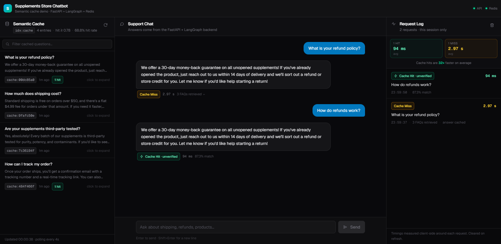
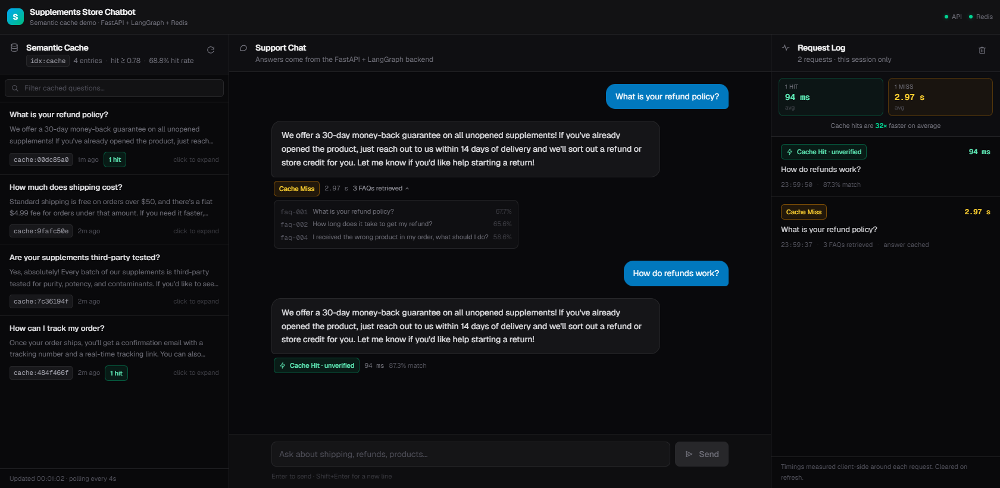
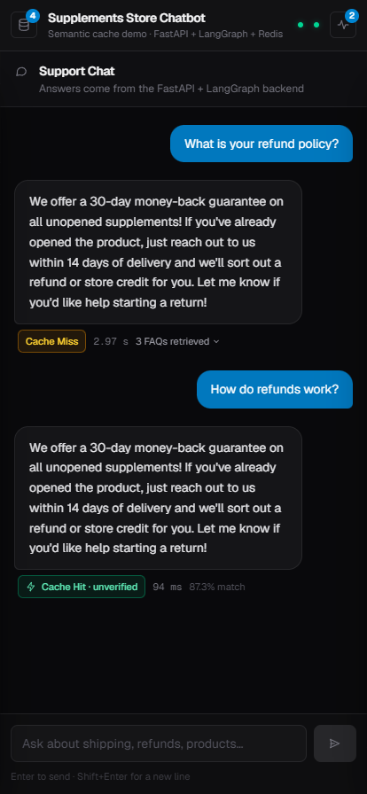
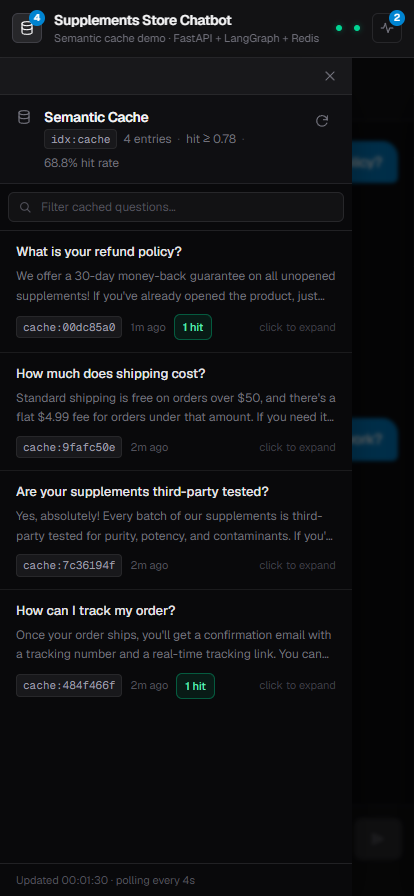

# Supplements Store Chatbot

An e-commerce support chatbot built around a **semantic cache**: questions that
*mean* the same thing as one already answered are served straight from Redis,
without ever reaching the LLM.

FastAPI + LangGraph backend, local open-source embeddings, Redis Stack for vector
search, and a Next.js frontend whose whole job is to make the caching behaviour
visible while you use it.



*A real session. The first question misses the cache and takes **3.75 s** (KB
retrieval + LLM). The reworded follow-up — "order" became "package" — matches the
cached entry at **88.3%** similarity and returns in **35 ms**.*

## What this project demonstrates

- **Vector search as a caching layer**, not just retrieval — embed the question,
  KNN against previously-answered questions, serve on a similarity threshold.
- **A graph-structured LLM workflow** (LangGraph) where the cache check is a
  routing decision that can skip the expensive branch entirely.
- **RAG done properly** on the miss path: KNN over a FAQ knowledge base supplies
  grounded context before generation.
- **Verification on top of similarity** — a grey band where a borderline match
  has to agree with the incoming question's knowledge-base anchor before it is
  served, which measurably halves the false-hit rate at no cost in recall.
- **Thresholds that are measured, not guessed** — two sweep harnesses over
  labelled datasets, whose output is the table published in this README.
- **Two interchangeable LLM backends** behind one interface — hosted OpenAI or a
  local OpenAI-compatible server — selected by `LLM_BACKEND`.
- **A frontend that explains the system it's talking to**, surfacing hit/miss,
  similarity scores, response times, and the live contents of the cache index.
- **No API cost for embeddings.** `BAAI/bge-base-en-v1.5` runs locally via
  `sentence-transformers`; only the generation step calls out.

## Architecture

```
  Browser — three-panel UI  (:3000)
      │
      │  same-origin fetch only
      ▼
  Next.js Route Handlers ─────────────────► Redis   FT.SEARCH idx:cache
      │                                             (feeds the cache panel)
      │  POST /chat  (:8000)
      ▼
  FastAPI ──► LangGraph workflow
                  │
                  ├─ check_guardrail ────► Redis   KNN 1 over idx:guardrail
                  │       │
                  │       └─ blocked ─► canned refusal, no LLM, cache untouched
                  │
                  ├─ check_cache ────────► Redis   KNN 1 over idx:cache
                  │       │
                  │       ├─ hit  ──► return the stored answer      ~41 ms
                  │       │           (grey band verifies first     ~76 ms)
                  │       │
                  │       └─ miss ──► retrieve_context ──► Redis   KNN 3 over idx:kb
                  │                   generate_answer   ──► LLM
                  │                   save_cache        ──► Redis   new cache:<uuid>
                  ▼                                                 ~3.75 s
          { answer, is_cached, cache_similarity, cache_band, sources, ... }
```

Each of the three outcomes ends in its own terminal recording node, so every
request increments exactly one counter behind `GET /stats`.

The browser never talks to FastAPI or Redis directly. The backend registers no
CORS middleware, so every call is proxied server-side through Next.js — which
also keeps the Redis connection string out of the client bundle.

## The core process

Every question takes one of **three** paths, and the UI labels which one it took.

### Blocked — the guardrail path

```
question ──► embed (local) ──► KNN 1 over idx:guardrail
                                          │
                              nearest exemplar is `block`
                              and similarity ≥ 0.55?
                                          │ yes
                              return that exemplar's canned response
```

The cache is never searched and no LLM call is made. See
[the guardrail section](#the-input-guardrail-is-a-router-not-a-security-boundary)
for what that threshold is worth and where it fails.

### Cache hit — the fast path

```
question ──► embed (local) ──► KNN 1 over idx:cache
                                          │
                        ┌─────────────────┼─────────────────┐
                   sim ≥ 0.90        0.78 ≤ sim < 0.90    sim < 0.78
                        │                 │                 │
                   confident          grey band            miss
                   serve it              │              (full path)
                   ~41 ms                │
                            KNN 2 over idx:kb for both
                            questions' anchor FAQs
                                         │
                    ┌────────────────────┼────────────────────┐
              either anchor        anchors agree         anchors disagree
              undecided                  │               (both decisive)
              (margin < 0.05)            │                    │
                    │                    │                    │
               unverified            verified             rejected
               serve it              serve it            → miss path
                                      ~76 ms          (near miss reported)
```

A confident hit issues **exactly one KNN** — it returns before any anchor
lookup is even considered, which is why the fast path stayed fast when the grey
band was added. On a hit there is no knowledge-base lookup, no LLM call and no
new cache write; `sources` comes back empty precisely because retrieval was
skipped.

### Cache miss — the full path

```
question ──► embed ──► KNN 1 over idx:cache ──► below threshold
                                                     │
                              KNN 3 over idx:kb ─────┘        (grounding)
                                     │
                              LLM generate_answer              (the slow part)
                                     │
                              save cache:<uuid> + EXPIRE 24h   ~3.75 s total
```

The answer is written back as a new `cache:<uuid>` document, so the *next*
semantically similar question takes the fast path.

<details>
<summary><b>Screenshot: the retrieved FAQs behind a cache miss</b></summary>

Expanding "3 FAQs retrieved" shows the actual KNN results from `idx:kb` with
their similarity scores — the grounding context the LLM was given.



</details>

## Why this is worth caching

Measured on this machine, local LLM backend, from the request log above:

| | Response time | LLM call | KB lookup |
|---|---|---|---|
| Cache miss | **3.75 s** | yes | yes (KNN 3) |
| Cache hit | **35 ms** | no | no |

Roughly **100× faster**, and every hit is a generation request that never
happened. On a real support bot — where a long tail of customers ask the same
dozen questions in different words — that is the difference between paying per
answer and paying per *distinct* answer.

### The threshold is a real tradeoff

A single cosine threshold is wrong in both directions. Measured against
`BAAI/bge-base-en-v1.5`, with the band each pair lands in today:

| Pair | Similarity | Outcome |
|---|---|---|
| "How can I track my order?" → "How do I track my package?" | 0.883 | `verified` hit ✅ |
| "Can I cancel my order after placing it?" → "How do I cancel an order I just placed?" | 0.947 | `confident` hit ✅ |
| "What is your refund policy?" → "Can I get my money back on an unopened tub?" | 0.673 | **miss** — a fair paraphrase that re-runs the LLM |
| "How long does shipping take?" → "How much does shipping cost?" | 0.809 | `rejected` — caught by anchor verification |

The third row is still a genuine cost and is not fixed: a paraphrase that the
embedding scores at 0.673 re-runs the LLM, and no threshold recovers it without
letting worse matches through.

The fourth row used to be the dangerous one. With "How long does shipping
take?" cached, asking about shipping *cost* scores 0.809 — comfortably over the
threshold — and was served the *delivery time* answer. A single global cosine
threshold genuinely cannot separate "reworded" from "related", which is the
whole reason the grey band exists: between 0.78 and 0.90 the match is only a
candidate, and it has to agree with the incoming question's KB anchor before it
is served. Here `faq-006` (shipping time) and `faq-005` (shipping cost) disagree
decisively, so the match is declined and the near-miss score is reported instead
of the wrong answer.

### What that verification actually bought

Not an assertion — a measurement. The harness sweeps both modes over a labelled
pair set and prints this table:

<!-- BEGIN sweep-cache -->
```bash
python scripts/eval_threshold.py
```

23 labelled pairs (13 should hit, 10 should not), where **`should_hit` is true
iff the cached answer for `a` fully answers `b`** — a judgement about answers,
not about wording. Labelling similarity would make the sweep circular.

**`false_hit_rate = FP / (FP + TN)`** — of the pairs that should *not* have been
served from cache, the fraction that were.

**Mode `single`** — predicted hit iff `similarity >= t` (the pre-verification behaviour):

| Threshold | TP | FP | FN | TN | Precision | Recall | F1 | False-hit rate |
|---|---|---|---|---|---|---|---|---|
| 0.740 | 11 | 4 | 2 | 6 | 0.733 | 0.846 | 0.786 | 0.400 |
| 0.760 | 11 | 3 | 2 | 7 | 0.786 | 0.846 | 0.815 | 0.300 |
| **0.780** | **11** | **2** | **2** | **8** | **0.846** | **0.846** | **0.846** | **0.200** |
| 0.800 | 11 | 2 | 2 | 8 | 0.846 | 0.846 | 0.846 | 0.200 |
| 0.820 | 8 | 1 | 5 | 9 | 0.889 | 0.615 | 0.727 | 0.100 |
| 0.840 | 8 | 0 | 5 | 10 | 1.000 | 0.615 | 0.762 | 0.000 |
| 0.900 | 2 | 0 | 11 | 10 | 1.000 | 0.154 | 0.267 | 0.000 |

**Mode `banded`** — the shipped `classify_match()`, `CACHE_HIT_THRESHOLD_HIGH=0.90`,
`CACHE_ANCHOR_MARGIN_MIN=0.05`:

| Threshold | TP | FP | FN | TN | Precision | Recall | F1 | False-hit rate |
|---|---|---|---|---|---|---|---|---|
| 0.740 | 11 | 1 | 2 | 9 | 0.917 | 0.846 | 0.880 | 0.100 |
| 0.760 | 11 | 1 | 2 | 9 | 0.917 | 0.846 | 0.880 | 0.100 |
| **0.780** | **11** | **1** | **2** | **9** | **0.917** | **0.846** | **0.880** | **0.100** |
| 0.800 | 11 | 1 | 2 | 9 | 0.917 | 0.846 | 0.880 | 0.100 |
| 0.820 | 8 | 1 | 5 | 9 | 0.889 | 0.615 | 0.727 | 0.100 |
| 0.840 | 8 | 0 | 5 | 10 | 1.000 | 0.615 | 0.762 | 0.000 |
| 0.900 | 2 | 0 | 11 | 10 | 1.000 | 0.154 | 0.267 | 0.000 |

(The full 13-row sweep from 0.70 to 0.94 is what the command prints; the rows
around the shipped threshold are reproduced here.)
<!-- END sweep-cache -->

**At the shipped threshold of 0.78, verification halves the false-hit rate —
0.200 → 0.100 — and costs nothing in recall (0.846 either way).** That is the
claim Phase 3 made on six hand-checked pairs, now measured on 23. The one
remaining false hit is the refunds pair, where both anchors are a coin flip
between two near-duplicate FAQs and the margin guard correctly refuses to let
either one veto.

Note what the single-threshold mode cannot do: to reach a 0.100 false-hit rate
on its own it has to go to 0.820, which drops recall from 0.846 to 0.615. The
band buys the same precision for free.

`CACHE_ANCHOR_MARGIN_MIN = 0.05` was **tested and kept**, not inherited. F1
holds flat at 0.880 across the whole band 0.03–0.10, so 0.05 sits in the middle
of the widest optimum. Outside it the value is measurably worse: at ≤ 0.02 the
guard stops protecting the coin-flip refunds pair and recall falls to 0.769; at
≥ 0.15 it swallows the shipping anchors too and the 0.809 false hit is served
again.

Every number here is relative to this 10-FAQ corpus, this embedding model and
23 labelled pairs. That is enough to replace anecdote with method and not
enough to claim a calibrated production threshold. Re-run the command after any
corpus or model change — a model swap invalidates the table by design.

## The input guardrail is a router, not a security boundary

Before the cache is searched, the question's embedding is matched against 27
labelled exemplars in `idx:guardrail` (`data/guardrail_examples.json`). If the
nearest one is a `block` exemplar *and* the similarity clears
`GUARDRAIL_THRESHOLD`, the question is refused with that exemplar's canned
response — no LLM call, and the cache is never touched.

The `allowed:` exemplars are load-bearing rather than decoration. Without them
a legitimate product question like "Is creatine safe?" has nothing nearby to
land on and drifts toward the nearest blocked cluster.

`GUARDRAIL_THRESHOLD` shipped as an explicit placeholder. It is now measured:

<!-- BEGIN sweep-guardrail -->
```bash
python scripts/eval_guardrail.py
```

24 **held-out** questions (12 should block, 12 should allow) against the 27
seeded exemplars. No text is shared with `data/guardrail_examples.json` — an
exemplar scores ~1.0 against itself, so evaluating on the training set would
manufacture a flattering threshold that says nothing about an unseen question.

**`false_block_rate = FP / (FP + TN)`** — of the questions that should have been
allowed, the fraction the guardrail refused.

| Threshold | TP | FP | FN | TN | Precision | Recall | F1 | False-block rate |
|---|---|---|---|---|---|---|---|---|
| 0.450 | 10 | 1 | 2 | 11 | 0.909 | 0.833 | 0.870 | 0.083 |
| 0.500 | 10 | 1 | 2 | 11 | 0.909 | 0.833 | 0.870 | 0.083 |
| **0.550** | **10** | **1** | **2** | **11** | **0.909** | **0.833** | **0.870** | **0.083** |
| 0.575 | 9 | 1 | 3 | 11 | 0.900 | 0.750 | 0.818 | 0.083 |
| 0.600 | 8 | 1 | 4 | 11 | 0.889 | 0.667 | 0.762 | 0.083 |
| 0.700 | 5 | 0 | 7 | 12 | 1.000 | 0.417 | 0.588 | 0.000 |
| 0.725 | 3 | 0 | 9 | 12 | 1.000 | 0.250 | 0.400 | 0.000 |
| 0.800 | 1 | 0 | 11 | 12 | 1.000 | 0.083 | 0.154 | 0.000 |

(The full 21-row sweep from 0.40 to 0.90 is what the command prints. The grid
steps by 0.025, so the retired 0.72 does not appear as a row — `0.725` is the
nearest, and scores identically.)
<!-- END sweep-guardrail -->

**The sweep moved the threshold from 0.72 to 0.55.** The old value was badly
miscalibrated: it sat above the similarity of 9 of the 12 questions that should
have been blocked, scoring F1 0.400 against 0.55's 0.870 and recall 0.250
against 0.833. The cost of the move is one false block out of 12 allow
questions — "Can I take this on an empty stomach?", whose nearest exemplar is a
medical one at 0.687 — so the false-block rate went from 0.000 to 0.083.

Two findings worth publishing rather than hiding:

- **The threshold is doing less work than it looks.** F1 is nominally highest
  (0.917) below 0.435, but that is beneath the lowest similarity any question
  scored, so the gate never binds and the number is really the accuracy of the
  nearest-exemplar *router* with the threshold switched off. The harness
  excludes such rows from its recommendation for exactly that reason.
- **Some errors no threshold can fix.** "Help me debug this JavaScript error."
  routes to an `allow` exemplar, so it is served at *every* threshold. Fixing
  that means adding an exemplar, not turning a knob.

**This is best-effort semantic routing, not a security boundary.** It is a
nearest-neighbour vote over 27 examples. It has a measured 0.083 false-block
rate and a measured 0.167 miss rate on a 24-question set, both of which will
move on a different corpus. Do not put it in front of anything that matters, and
do not read the Next.js proxy as an access control layer either — see
[what this deliberately does not do](#what-this-deliberately-does-not-do).

## Tech stack

**Backend**

- **FastAPI** — HTTP API, served docs at `/docs`
- **LangGraph** — orchestrates: check cache → (miss) retrieve context → generate answer → save to cache
- **OpenAI-compatible chat** — either hosted OpenAI (`gpt-4o-mini`, `app/llm.py`)
  or a local OpenAI-compatible server (`app/llm_local.py`); see
  [Chat backends](#chat-backends-hosted-openai-vs-local)
- **sentence-transformers** — `BAAI/bge-base-en-v1.5` (local, open-source, no API cost) for embeddings
- **Redis Stack** (RedisJSON + RediSearch) — knowledge base storage, vector search, and semantic cache
- **Pydantic** — request/response schemas (`app/schemas.py`) and settings (`app/config.py`)

**Frontend** (`frontend/`)

- **Next.js 16** (App Router) + **React 19** + **TypeScript**
- **Tailwind CSS v4**
- **node-redis 6** — read-only `FT.SEARCH` against `idx:cache` from a Route Handler

## Frontend

A three-panel dashboard. Each panel answers a different question about what the
system just did.

| Panel | Shows | Source |
|---|---|---|
| **Left** — Semantic Cache | Every `cache:*` entry: question, stored answer, key, age | `FT.SEARCH idx:cache`, polled every 4s |
| **Middle** — Support Chat | The conversation, with a hit/miss badge, timing and similarity under each answer | `POST /chat` via a proxy route |
| **Right** — Request Log | One row per request: hit/miss, response time, similarity, timestamp | Client-side session state |

Design notes worth calling out:

- **The cache panel polls**, so answers cached by *another* session — or by a
  previous run, since entries live 24h — appear without a refresh. During a demo
  you can watch a new entry appear the instant a miss is answered.
- **Response time is measured in the browser**, around the `fetch`, because the
  backend returns no timing field. The request log's "107× faster" line is
  computed from those measurements.
- **Cache entries carry their own `created_at`**, so "1m ago" is a real age read
  off the document rather than an approximation from the key's remaining TTL.
  The panel also shows a per-entry hit count and a live hit rate from
  `GET /stats`, both of which move while you use the app.
- **The request log is deliberately ephemeral.** No polling, no log endpoint, no
  persistence; it is session state and clears on refresh.
- **Degraded states are explicit.** Redis unreachable, `idx:cache` not created
  yet, backend down, and LLM unreachable each produce a specific message rather
  than a generic error.

### Responsive

Three columns on desktop; below `lg` the chat goes full-width and the side panels
become drawers, each with a badge showing its item count.

| Chat | Cache drawer |
|---|---|
|  |  |

Full frontend documentation, including the API contract it is built against, is
in [`frontend/README.md`](frontend/README.md).

## Redis data model

Two RedisJSON collections, each with its own RediSearch vector index.

### 1. Knowledge base — `kb:<id>`

```json
// key: kb:faq-005
{
  "id": "faq-005",
  "category": "shipping",
  "question": "How much does shipping cost?",
  "answer": "Standard shipping is free on all orders over $50. ...",
  "embedding": [0.0123, -0.0456, ...]   // 768 floats, BAAI/bge-base-en-v1.5
}
```

Index `idx:kb` (`FT.CREATE idx:kb ON JSON PREFIX 1 kb: SCHEMA ...`):

| JSON path       | Alias       | Type              |
|------------------|-------------|-------------------|
| `$.question`     | `question`  | TEXT              |
| `$.answer`       | `answer`    | TEXT              |
| `$.category`     | `category`  | TAG               |
| `$.embedding`    | `embedding` | VECTOR (HNSW, COSINE, DIM 768, FLOAT32) |

On every question, the workflow embeds the question and runs a `KNN 3`
query against `idx:kb` to pull the 3 most relevant FAQs as context for the LLM.

### 2. Semantic cache — `cache:<uuid>`

```json
// key: cache:1f2e3d4c-...
{
  "query": "how long till my refund shows up",
  "answer": "Once we receive and inspect your return, refunds are processed within 3-5 business days...",
  "embedding": [0.0231, -0.0198, ...],

  "created_at": 1757635200,
  "hits": 3,
  "kb_anchor": "faq-004",
  "kb_anchor_margin": 0.125,
  "model": "BAAI/bge-base-en-v1.5"
}
```

Index `idx:cache` (same shape as `idx:kb`, over the `cache:` prefix):

| JSON path     | Alias    | Type                                      |
|----------------|----------|--------------------------------------------|
| `$.query`      | `query`  | TEXT                                       |
| `$.answer`     | `answer` | TEXT                                       |
| `$.embedding`  | `embedding` | VECTOR (HNSW, COSINE, DIM 768, FLOAT32) |

**The five metadata fields are deliberately not in the index schema.**
RediSearch returns an unindexed JSON path given the explicit `RETURN $.path AS
alias` form, so both the backend and the dashboard read them at no cost, and
adding them to the schema would buy nothing — nothing filters or sorts on them
inside Redis. Keeping them out also means adding them needed no `FT.ALTER`, no
index drop, and no volume wipe.

| Field        | Why it exists                                                                 |
|--------------|-------------------------------------------------------------------------------|
| `created_at` | Epoch seconds at write time. The dashboard shows a real age instead of inferring one from the remaining TTL. |
| `hits`       | `JSON.NUMINCRBY`'d on every hit, so you can see which entries earn their TTL.  |
| `kb_anchor`  | The top `idx:kb` match at write time — which FAQ the answer was grounded in. Free: the miss path had already retrieved it. |
| `kb_anchor_margin` | How far that FAQ beat the runner-up. The anchor alone cannot say whether it is trustworthy: two near-duplicate FAQs produce a top-1 pick that is a coin flip, and a coin flip must never veto a later match. Also free — same search. |
| `model`      | Makes an embedding-model swap visible in the data rather than only in `.env`.  |

**`JSON.NUMINCRBY` does not reset the key's TTL** — measured against this
container: a key at `TTL 1000` read back `999` after an increment and a short
wait, i.e. it kept decaying normally. That is the property that makes the
per-entry counter safe to keep inside the document: counting a popular entry
can never make it immortal.

Every `cache:*` key gets a Redis `EXPIRE` set to `CACHE_TTL_SECONDS`
(default 24h), so entries age out on their own — no separate cleanup job.
RediSearch keeps its index in sync with keyspace expirations, so an expired
entry stops showing up in KNN results. One caveat worth publishing rather than
hiding: that is precisely true on Redis 8, and approximate on the **Redis 7.4**
this container actually runs, where [expiration times are not taken into account
when computing the result
set](https://redis.io/docs/latest/develop/ai/search-and-query/advanced-concepts/expiration/).
So a count like `/stats`'s `cache_entries` can transiently include entries that
have expired but not yet been actively reclaimed.

**Cache lookup logic:** embed the incoming question, run `KNN 1` against
`idx:cache`, and convert the returned cosine distance to a similarity
(`1 - score`). That similarity then falls into one of three bands rather than
being tested against a single line:

| Band | Range | What happens |
|---|---|---|
| **confident** | `similarity >= CACHE_HIT_THRESHOLD_HIGH` (0.90) | Served immediately. No verification lookup is issued at all, so the fast path stays as fast as it was. |
| **grey** | `CACHE_SIMILARITY_THRESHOLD <= similarity < 0.90` | Verified before it is served — see below. |
| **miss** | `similarity < CACHE_SIMILARITY_THRESHOLD` (0.78) | Answered from scratch, as before. |

In the **grey band** the incoming question's *KB anchor* — its nearest `idx:kb`
FAQ, resolved with one `KNN 2` — is compared against the anchor the cache entry
recorded at write time. Two questions that reword each other land on the same
FAQ; two questions that merely share a topic land on different ones. Agreement
serves the cached answer (`verified`); disagreement rejects it (`rejected`) and
the request takes the full path.

That comparison is only worth making when the anchor is actually decisive, so it
is gated by a **margin guard**: when either side's top FAQ beat its runner-up by
less than `CACHE_ANCHOR_MARGIN_MIN`, that anchor is a coin flip between two
near-duplicate FAQs and carries no information. It is then permitted neither to
veto nor to confirm, and the match is served as `unverified`. `0.05` is a
starting point derived from this 10-FAQ corpus, not a calibrated value.

`CACHE_VERIFY_GREY_BAND=false` restores the single-threshold behaviour exactly —
the grey band serves without any anchor lookup — while still reporting a band,
so the response shape never varies with the flag.

All of this is what makes it a *semantic* cache — "how long till my refund shows
up" can hit a cache entry saved for "How long does it take to get my refund?"
even though the wording differs — while giving a merely topically-related
question a second chance to be turned away.

## Workflow (LangGraph)

```
START -> embed_question -> check_guardrail --(blocked)--> record_blocked -> END
                                |
                             (allowed)
                                v
                           check_cache --(hit)--> record_hit -> END
                                |
                             (miss)
                                v
                  retrieve_context -> generate_answer -> check_answer --(skip)--> record_miss -> END
                                                             |                         ^
                                                          (cache)                      |
                                                             v                         |
                                                        save_cache ---------------------
```

1. **embed_question** — embed the question once, symmetrically (no bge query
   prefix). Both the guardrail and the cache compare question ↔ question, so
   they share this one vector; only KB retrieval re-embeds, with
   `is_query=True`, because that comparison is question → passage.
2. **check_guardrail** — KNN search `idx:guardrail`. A refusal ends the request
   here: no LLM call, and `idx:cache` is never searched.
3. **check_cache** — KNN search `idx:cache`, whose result is a *band* rather
   than a yes/no (see "Cache lookup logic" above). `confident` and `verified`
   and `unverified` all set `is_cached=True` and route to `record_hit`;
   `rejected` — close on wording but anchored to a different FAQ — sets
   `is_cached=False` and takes the miss path, reporting the near-miss score as
   `rejected_similarity`. The band is data carried in state, not a new branch:
   the graph topology is unchanged.
4. **retrieve_context** (miss only) — KNN search `idx:kb` for the top-K
   relevant FAQs.
5. **generate_answer** — call the LLM with the FAQ context + question.
6. **check_answer** — the output guardrail, a gate on the cache *write* rather
   than on the response. A rejected answer still reaches the user; only the
   cache entry is suppressed, and `not_cached_reason` says why.
7. **save_cache** — store the question, answer, the embedding already computed
   in step 1, and the five metadata fields under a fresh `cache:<uuid>` key
   with a TTL. Logs `CACHE MISS / NOT CACHED`.
8. **record_hit / record_miss / record_blocked** — terminal nodes that each
   increment one counter (`app/metrics.py`). Counting lives here rather than
   inside `check_cache` so that every path through the graph increments exactly
   once, including a path that begins as a hit and is later rejected — which is
   exactly what a grey-band rejection is. A rejection counts one miss, counts no
   hit, and leaves the declined entry's own `hits` counter and TTL untouched.

`record_miss` has two incoming edges — a written answer and a suppressed one
are both misses — and still counts once, because only one of those paths runs
per request.

The API response always includes `is_cached: true/false` (see
`app/schemas.py::ChatResponse`).

## API

`POST /chat`

```jsonc
// request
{ "question": "How do I track my package?" }

// response
{
  "answer": "Once your order ships, you'll get a confirmation email...",
  "is_cached": true,          // hit/miss flag the UI badges directly
  "cache_similarity": 0.883,  // non-null only on a hit
  "sources": [],              // populated only on a miss — a hit skips KB retrieval

  "guardrail": null,          // set only when the input guardrail blocked the
                              // question, e.g.
                              // {"label": "blocked:medical_advice",
                              //  "similarity": 0.923, "action": "block"}
                              // — in which case `answer` is its canned
                              // response and no LLM call was made
  "not_cached_reason": null,  // why the answer was not written to the cache:
                              // too_short | refusal | ungrounded |
                              // generation_failed. The answer still reached
                              // the user either way
  "cached_now": false,        // true only when this request's answer was
                              // freshly cached; false on a hit and on a block
  "cached_hits": 3,           // the matched entry's hit total after this
                              // request. Set only on a hit, and null even then
                              // for an entry written before cache documents
                              // carried a `hits` field
  "cache_band": "verified",   // which band the lookup landed in:
                              // confident | verified | unverified | rejected.
                              // null on a plain miss and on a block, where no
                              // band was ever decided. Populated regardless of
                              // CACHE_VERIFY_GREY_BAND, so the response shape
                              // never varies with the flag
  "rejected_similarity": null // the near-miss score of an entry declined on an
                              // anchor mismatch. Non-null only when
                              // `cache_band` is "rejected" — without it a
                              // rejection is indistinguishable from an
                              // ordinary miss
}
```

Error statuses:

| Status | Condition |
|--------|-----------|
| `422`  | Empty question, or longer than `MAX_QUESTION_CHARS` (Pydantic validation) |
| `429`  | Rate limit exceeded — `RATE_LIMIT_MAX_REQUESTS` per `RATE_LIMIT_WINDOW_SECONDS`, with a `Retry-After` header |
| `502`  | The LLM backend is unreachable. Only misses need it; hits keep working |

The Next.js proxy at `/api/chat` mirrors the length bound and returns `400` at
that boundary, so the browser sees the failure before the request reaches
FastAPI.

`GET /stats`

```jsonc
{
  "hits": 12,                 // lifetime cache hits
  "misses": 7,                // lifetime misses (answered by the LLM)
  "blocked": 2,               // lifetime guardrail refusals
  "total": 19,                // hits + misses. Blocked questions never reached
                              // the cache, so they are not in the denominator
  "hit_rate": 0.6315789473684211,
  "llm_calls_avoided": 12,    // the same number as `hits`, under the name that
                              // states the point: every hit is a generation
                              // that never happened
  "cache_entries": 7,         // live docs in idx:cache, from the same
                              // FT.SEARCH the dashboard runs — so /stats and
                              // the cache panel can never disagree
  "today": { "hits": 5, "misses": 2 }   // current UTC day; these keys expire
                                        // after STATS_DAILY_TTL_SECONDS
}
```

The counters live in Redis as plain strings under `cache:stats:` (see
`app/metrics.py`), and every path through the graph increments exactly one of
them from a terminal node, so hits + misses + blocked always equals the number
of requests answered. `/stats` is deliberately **not** rate limited: the
limiter exists to bound LLM spend, not to ration a handful of Redis reads.

`GET /health` → `{"status": "ok"}`. No authentication; this is a local demo.

## Chat backends: hosted OpenAI vs. local

Only the `generate_answer` step calls an LLM (embeddings are already local).
There are two interchangeable modules for it, with an identical public
surface — `SYSTEM_PROMPT` and `generate_answer(question, context)`:

| Module             | Talks to                                     | Model setting                    |
|--------------------|----------------------------------------------|----------------------------------|
| `app/llm.py`       | hosted OpenAI (`api.openai.com`)             | `CHAT_MODEL` (`gpt-4o-mini`)     |
| `app/llm_local.py` | `LOCAL_LLM_BASE_URL` (`127.0.0.1:8080/v1`)   | `LOCAL_CHAT_MODEL` (`sonnet`)    |

Switch between them with one setting — no source edit:

```bash
LLM_BACKEND=local     # app/llm_local.py, the default
LLM_BACKEND=openai    # app/llm.py, the hosted API
```

`app/llm_factory.py` resolves that to a `generate_answer`, importing only the
branch you asked for — both modules construct an `OpenAI` client at import, so a
top-level import of both would build a hosted client (and read
`OPENAI_API_KEY`) on every local run for a function that is never called. Any
other value raises at import rather than falling back to a default: a typo that
quietly changed which LLM you are billing for is the failure mode worth being
loud about.

Nothing else in the app changes — the workflow, cache, and KB behave
identically either way. Both modules are kept in the repo so you can flip
back and forth without deleting anything.

> This used to be a commented-out import in `app/workflow.py`. It was a code
> change to express a deployment choice, which is not something a reader should
> have to read a diff to discover.

### Running the local OpenAI-compatible server

The local provider is a standalone `local-openai.exe` that exposes an
OpenAI-compatible API in front of the Claude CLI. In its **own PowerShell
window** (keep it open — this is the server):

```powershell
cd <folder containing local-openai.exe>
$env:CLAUDE_CODE_OAUTH_TOKEN = "your-token-here"
.\local-openai.exe
```

It logs its startup line and then every request:

```
time=... level=INFO msg=listening addr=127.0.0.1:8080 provider=claude-cli model=sonnet auth=false
```

The `CLAUDE_CODE_OAUTH_TOKEN` env var is what authenticates the underlying
Claude CLI. Without it (or with an expired token) the server starts fine and
accepts requests, but completions come back as `502` with
`claude CLI reported an error: Not logged in`.

#### Endpoints it exposes

| Method | Path                    | Notes                                  |
|--------|-------------------------|----------------------------------------|
| `POST` | `/v1/chat/completions`  | JSON, or SSE when `"stream": true`     |
| `GET`  | `/v1/models`            | the model IDs the provider accepts     |
| `GET`  | `/v1/models/{model}`    | 404 for unknown IDs                    |
| `GET`  | `/healthz`              | never authenticated                    |
| `GET`  | `/`                     | service description                    |

Sanity-check it before pointing the app at it:

```bash
curl http://127.0.0.1:8080/healthz    # -> {"provider":"claude-cli","status":"ok"}
curl http://127.0.0.1:8080/v1/models  # -> sonnet, opus, haiku, gpt-4o, gpt-4o-mini, ...
```

`LOCAL_CHAT_MODEL` must be one of the IDs from `/v1/models` — unknown IDs
return 404. The server ignores credentials, so `LOCAL_LLM_API_KEY` stays a
placeholder (`unused`); the `openai` Python client just requires *some*
non-empty value.

The equivalent of what `app/llm_local.py` does, in miniature:

```python
from openai import OpenAI

client = OpenAI(base_url="http://127.0.0.1:8080/v1", api_key="unused")
client.chat.completions.create(model="sonnet", messages=[{"role": "user", "content": "Hi"}])
```

Requests are proxied to a slower backend than the hosted API, so the client
is built with a generous `LOCAL_LLM_TIMEOUT_SECONDS` (default 120s) instead
of the SDK's default timeout.

## Getting started

### 0. Start the local LLM server (only if using `app/llm_local.py`)

See [Running the local OpenAI-compatible server](#running-the-local-openai-compatible-server)
above — set `CLAUDE_CODE_OAUTH_TOKEN`, run `.\local-openai.exe`, leave that
window open. Skip this entirely if you're using hosted OpenAI.

### 1. Start Redis Stack

```bash
docker compose up -d
```

This runs `redis/redis-stack`, which bundles the RedisJSON and
RediSearch modules that `FT.CREATE` / `FT.SEARCH` and `JSON.SET` need
(plain `redis:latest` does **not** include these modules), plus the
**RedisInsight** web UI on port `8001` — open
**http://localhost:8001/redis-stack/browser** to browse keys, run
commands, and inspect the `kb:*` / `cache:*` documents visually.

### 2. Configure environment

```bash
cp .env.example .env
```

Then set `LLM_BACKEND` in `.env` for whichever chat backend you're using:

- **Hosted OpenAI** (`LLM_BACKEND=openai`) — set `OPENAI_API_KEY`. `CHAT_MODEL`
  defaults to `gpt-4o-mini`.
- **Local server** (`LLM_BACKEND=local`, the default) — no key needed.
  `OPENAI_API_KEY` can
  be left empty, and the defaults
  (`LOCAL_LLM_BASE_URL=http://127.0.0.1:8080/v1`, `LOCAL_LLM_API_KEY=unused`,
  `LOCAL_CHAT_MODEL=sonnet`, `LOCAL_LLM_TIMEOUT_SECONDS=120`) work as-is
  against `local-openai.exe`.

Embeddings never need a key either way — they run locally via
`sentence-transformers`.

### 3. Install dependencies

```bash
python -m venv .venv
.venv\Scripts\activate        # Windows
pip install -r requirements.txt
```

`sentence-transformers` pulls in PyTorch, so this install is heavier than
before. The `BAAI/bge-base-en-v1.5` embedding model (~440MB) is downloaded
from Hugging Face on first run and cached locally
(`~/.cache/huggingface`/`%USERPROFILE%\.cache\huggingface` on Windows) — no
API key or network access is needed for embeddings after that.

### 4. Run the API

```bash
uvicorn app.main:app --reload
```

On startup the app creates all three RediSearch indexes and, if the knowledge
base is empty, automatically embeds and loads the 10 sample FAQs from
`data/faqs.json`. It also seeds the guardrail exemplars from
`data/guardrail_examples.json` whenever `idx:guardrail`'s document count
differs from that file's length. Editing an exemplar's *text* without changing
the count leaves the count matching, so re-seed explicitly for that — and to
reseed either collection manually, run:

```bash
python scripts/load_kb.py
```

### 5. Run the frontend

```bash
cd frontend
cp .env.example .env.local     # defaults already match the backend
npm install
npm run dev                    # http://localhost:3000
```

Cache **hits** work even if the LLM server isn't running; only **misses** need
it. See [`frontend/README.md`](frontend/README.md) for configuration.

## Running it

```bash
uvicorn app.main:app --reload
```

Keep this running in its own terminal — it prints `CACHE HIT` /
`CACHE MISS / NOT CACHED` for every request, which is the easiest way to
watch the workflow's routing decision live while you test.

With the local backend you end up with four windows open: `local-openai.exe`
(port 8080), Redis Stack via Docker (port 6379), uvicorn (port 8000), and the
Next.js dev server (port 3000). The `local-openai.exe` window logs each
`POST /v1/chat/completions`, so you can see exactly which questions actually
reached the LLM versus which were served from the semantic cache.

## Trying it by hand

Four ways to watch the routing decision happen. For the automated suite, see
[Testing](#testing).

### Option A — the UI (`http://localhost:3000`)

The fastest way to see the behaviour. Ask one of the starter questions, then ask
the paraphrase below it: the first is a miss, the second a hit, and the request
log shows both timings side by side. The starter pairs are pre-verified to clear
the 0.78 threshold.

### Option B — Swagger UI (`/docs`)

1. Open **http://127.0.0.1:8000/docs**.
2. Expand `POST /chat` → **Try it out**.
3. Send a body like:
   ```json
   { "question": "How long does shipping take?" }
   ```
4. Check the response: `is_cached` should be `false`, `cache_similarity`
   should be `null`, and `sources` should list 3 FAQs pulled from the
   knowledge base. The server console should log `CACHE MISS / NOT CACHED`.
5. Send the **exact same** question again. This time `is_cached` should be
   `true`, `cache_similarity` should be close to `1.0`, `sources` should be
   empty (the cache hit skips KB retrieval entirely), and the console
   should log `CACHE HIT`.
6. Send a **reworded** version of the same question, e.g.
   `"how many days till my package arrives"`. Because the cache match is
   semantic (embedding similarity), this should also come back as a cache
   hit even though no word overlaps with the original question.
7. Try `GET /health` — should return `{"status": "ok"}`.

### Option C — curl

```bash
# health check
curl http://127.0.0.1:8000/health

# first call -> cache miss, hits the LLM + knowledge base
curl -X POST http://127.0.0.1:8000/chat \
  -H "Content-Type: application/json" \
  -d '{"question": "What is your refund policy?"}'

# same question again -> cache hit, no LLM/KB call
curl -X POST http://127.0.0.1:8000/chat \
  -H "Content-Type: application/json" \
  -d '{"question": "What is your refund policy?"}'

# reworded question -> still a cache hit (semantic match)
curl -X POST http://127.0.0.1:8000/chat \
  -H "Content-Type: application/json" \
  -d '{"question": "when do I get my money back"}'
```

Other good questions to try, one per FAQ category in `data/faqs.json`:
`"My order arrived damaged, can I get a replacement?"`,
`"How much does shipping cost?"`,
`"How can I track my order?"`,
`"Can I cancel my order after placing it?"`,
`"Are your supplements third-party tested?"`.
Also try something the FAQs don't cover (e.g. `"Do you ship to the moon?"`)
to confirm the bot still answers sensibly using general knowledge instead
of erroring.

### Option D — inspect Redis directly

**Via RedisInsight (web UI):** open
**http://localhost:8001/redis-stack/browser**, connect to the local
Redis instance (host `redis`/`localhost`, port `6379`, no auth), and
browse the `kb:*` / `cache:*` keys, run `FT.SEARCH` / `JSON.GET` from
the built-in CLI, and watch TTLs count down on cache entries — all
without leaving the browser.

**Via `redis-cli`** (or `docker compose exec redis redis-cli`), you can watch
the two indexes and collections the app is reading/writing:

```bash
# how many FAQs / cache entries exist right now
FT.SEARCH idx:kb "*" LIMIT 0 0
FT.SEARCH idx:cache "*" LIMIT 0 0

# look at one FAQ document
JSON.GET kb:faq-001

# after asking a question via curl/Swagger, list the cache entry it created
KEYS cache:*
JSON.GET cache:<the-uuid-you-got-back> $.query $.answer

# confirm the cache entry has a TTL (in seconds)
TTL cache:<the-uuid-you-got-back>
```

### Resetting state between test runs

```bash
# wipe and reseed just the knowledge base + cache indexes/data
docker compose down -v && docker compose up -d
python scripts/load_kb.py
```

To clear only the cache (keeping the knowledge base), so the next questions are
guaranteed misses:

```bash
docker compose exec redis redis-cli --scan --pattern 'cache:*' | grep -v '^cache:stats:' | \
  xargs -r docker compose exec -T redis redis-cli DEL
```

The `grep -v` matters: the metrics counters (`app/metrics.py`) live at
`cache:stats:*`, which `cache:*` also matches. They survive this sweep on
purpose — clearing the cache to force a few misses should not silently reset
the hit rate you were measuring. Reset the counters separately when that is
actually what you want:

```bash
docker compose exec redis redis-cli --scan --pattern 'cache:stats:*' | \
  xargs -r docker compose exec -T redis redis-cli DEL
```

**Note:** if you're migrating an existing Redis instance from the OpenAI
embeddings (1536-dim) to the local model (768-dim), you must wipe the
volume as above — `FT.CREATE` won't alter an existing index's vector
dimension, so old and new embeddings can't coexist in the same index.

## Project layout

```
supplements-chatbot/
├── app/
│   ├── config.py            # pydantic-settings (.env)
│   ├── schemas.py           # ChatRequest/ChatResponse pydantic models
│   ├── redis_client.py      # shared redis-py connection
│   ├── vector_utils.py      # float list <-> FLOAT32 bytes
│   ├── embeddings.py        # local sentence-transformers embeddings wrapper
│   ├── knowledge_base.py    # kb:* documents + idx:kb (RediSearch)
│   ├── semantic_cache.py    # cache:* documents + idx:cache (RediSearch)
│   ├── guardrails.py        # guardrail:* + idx:guardrail, and should_cache()
│   ├── metrics.py           # cache:stats:* counters behind GET /stats
│   ├── rate_limit.py        # fixed-window limiter, as a FastAPI dependency
│   ├── llm.py               # chat wrapper -> hosted OpenAI
│   ├── llm_local.py         # chat wrapper -> local OpenAI-compatible server
│   ├── llm_factory.py       # resolves LLM_BACKEND to one of the two above
│   ├── workflow.py          # LangGraph StateGraph
│   └── main.py              # FastAPI app + /chat and /stats endpoints
├── frontend/                # Next.js 16 dashboard
│   ├── src/app/
│   │   ├── page.tsx         # Server Component: first read of idx:cache
│   │   └── api/             # chat proxy, cache reader, stats proxy, status probe
│   ├── src/components/      # Dashboard + the three panels
│   ├── src/lib/             # redis client, backend client, polling hook
│   └── README.md            # frontend docs + the API contract it targets
├── data/
│   ├── faqs.json                # 10 sample FAQs (knowledge base seed data)
│   ├── guardrail_examples.json  # 27 labelled exemplars (guardrail seed data)
│   ├── eval_pairs.json          # 23 labelled pairs — the cache sweep's test set
│   └── guardrail_eval.json      # 24 HELD-OUT questions — the guardrail's test set
├── scripts/
│   ├── load_kb.py               # standalone KB + exemplar loader
│   ├── eval_threshold.py        # cache threshold/band sweep -> markdown
│   └── eval_guardrail.py        # guardrail threshold sweep -> markdown
├── tests/                       # pytest suite (see Testing, below)
├── .github/workflows/ci.yml     # pytest over a Redis Stack service container
├── docs/screenshots/            # images used in this README
├── docker-compose.yml           # redis-stack (+ RedisInsight on :8001), redis-test
├── pytest.ini
├── requirements.txt
├── requirements-dev.txt         # -r requirements.txt plus pytest
└── .env.example
```

## Testing

The suite is pytest, and it needs **its own Redis instance**. RediSearch refuses
to create an index on any logical database but 0 — measured on this container:

```
$ docker compose exec -T redis redis-cli -n 15 FT.CREATE idx:__probe ON JSON \
    PREFIX 1 probe: SCHEMA '$.t' AS t TEXT
Cannot create index on db != 0
```

So tests cannot isolate themselves in `redis://127.0.0.1:6379/15`. Isolation has
to be a separate instance, which `docker-compose.yml` provides behind a profile
so a normal `docker compose up -d` does not start it:

```bash
pip install -r requirements-dev.txt
docker compose --profile test up -d redis-test   # :6380, no volume, starts empty
pytest
```

`tests/conftest.py` points the app at `:6380` by writing `REDIS_URL` **before**
the first `app` import — `app/redis_client.py` opens its connection at import
time, so a fixture-level monkeypatch would be too late and would silently test
the demo instance. Real environment variables outrank `.env` in
pydantic-settings, so this needs no change to your `.env`.

It also refuses to run against `:6379` at all, because the suite creates and
deletes `kb:*`, `cache:*`, `guardrail:*`, `cache:stats:*` and `rl:*` keys and
that is the instance you are probably mid-demo with. CI sets `ALLOW_DEV_REDIS=1`
because its service container *is* the throwaway instance; nothing else should.

| Command | What it runs |
|---|---|
| `pytest` | everything |
| `pytest -m "not redis"` | the pure subset — `classify_match()` and `should_cache()`, no Redis needed |
| `pytest tests/test_semantic_cache.py -v` | the band decisions, including the 0.809 rejection |

No test requires a reachable LLM: `tests/test_workflow.py` and
`tests/test_rate_limit.py` stub `app.workflow.generate_answer`. That stub has to
patch the name in `app.workflow`, not in `app.llm_local` — `app/workflow.py`
binds it into its own namespace at import, so patching the source module leaves
the compiled graph calling the real backend and the test hangs for the local
server's 120 s timeout instead of failing.

What the suite pins down, in the order it matters:

- the band boundaries, and that the **confident path issues zero anchor
  lookups** — asserted with an injected callable that records whether it was
  called, rather than left as a comment
- the margin guard, including that an undecided anchor may not veto *even when
  the anchors disagree*
- the grey-band rejection of the documented 0.809 false hit
- the self-healing rule for pre-Phase-3 cache documents, which a 24 h TTL makes
  the normal state for a day after any deploy
- all four `should_cache` reasons and their precedence
- that `JSON.NUMINCRBY` does not reset a key's TTL, so a popular entry cannot
  become immortal
- that every path through the graph increments **exactly one** counter

CI (`.github/workflows/ci.yml`) runs that suite against a
`redis/redis-stack-server` service container, plus the frontend's `eslint` and
`tsc --noEmit`.

## What this deliberately does not do

Some of these are missing because they are hard. Most are missing because adding
them would make the repo worse at the one thing it is for.

**No authentication, anywhere.** This is a local demo. The Next.js proxy keeps
`REDIS_URL` and `BACKEND_URL` out of the client bundle — that is bundle secrecy,
not an access boundary, and describing it as security would be wrong.

**No chat or session persistence.** `POST /chat` takes a bare question; the
conversation lives in browser React state and the request log clears on refresh.
This is a position, not an omission, and the reason is the cache: **its entire
value is that one user's answer serves another user's rephrasing.** Scoping the
lookup per session would destroy exactly what is being demonstrated. So the
cache is global on purpose, and there are no `session:*` keys to find.

**The guardrail is best-effort filtering.** A nearest-neighbour vote over 27
examples, with a measured false-block rate — not a moderation service and not a
security control. See [above](#the-input-guardrail-is-a-router-not-a-security-boundary).

**The rate limiter is effectively global.** Every request arrives from the
Next.js proxy, so `request.client.host` is the proxy's address for all users.
Its purpose is bounding LLM spend — a miss is a multi-second generation — not
isolating callers from each other. No forwarded-client header is trusted,
deliberately: doing so would be spoofable in an app with no auth *and* would
imply per-user isolation this topology cannot deliver.

**Single node.** No Cluster, Sentinel, or replication. One Redis, one uvicorn.

**Things that were considered and rejected**, so the reasoning is visible rather
than lost in a planning document:

| Candidate | Why not |
|---|---|
| Pub/Sub replacing the 4 s cache-panel poll | Real-time for its own sake. The poll is documented, works, and demos fine; a WebSocket layer teaches nothing about semantic caching |
| Redis Streams as this repo's request log | This README argues the log is ephemeral by design. Don't contradict your own reasoning to add a data type |
| Full chat history in Redis | See above — a session-scoped cache is a strictly worse cache |
| Exact-match cache keyed by question hash | The semantic cache already subsumes it; a second layer confuses the story to save ~15 ms |
| Redis as a job queue, multi-tenancy, auth | Off-story for a local reference implementation |
| Redis Vector Sets (`VADD` / `VSIM`) as an alternative backend | Genuinely interesting and directly on-story, but it would double the cache surface area of a repo whose strength is being readable in one sitting. Belongs in its own comparison |
| RedisTimeSeries hit-rate sparkline | Wants `/stats` to exist first, which it now does — but it is charting, not caching |

The nearest thing to a real gap: a FAQ edit leaves dependent cache entries stale
for up to `CACHE_TTL_SECONDS`. The fix is small and known — index `kb_anchor` as
a TAG on `idx:cache`, then `FT.SEARCH idx:cache "@kb_anchor:{faq-005}"` and
`DEL` the matches — and it is not implemented here.

## Background

Built as a Python translation of the patterns used in the local
`reference/redish/openai-version` project (RedisJSON documents + a RediSearch
vector index for KNN lookups, and a LangGraph workflow that checks a cache
before ever calling the LLM).

The reference project's semantic cache uses Redis's managed **LangCache** API.
This project doesn't depend on that managed service — it implements the same
"embed the question, KNN search, threshold on similarity" idea directly against
a self-hosted Redis Stack instance, so the whole thing runs with just
`docker compose up`.
