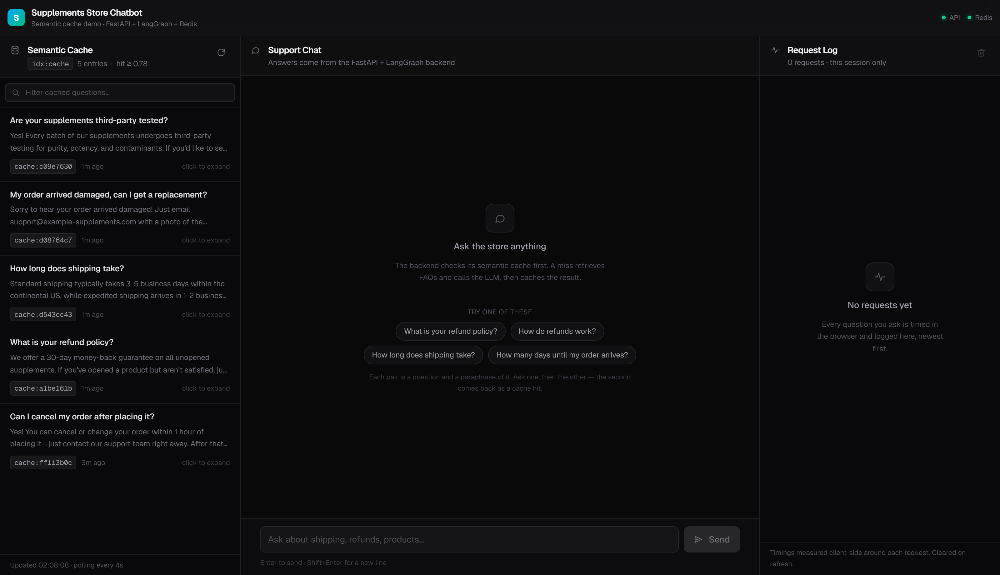

# Supplements Chatbot — Frontend

A three-panel Next.js UI for the FastAPI + LangGraph backend in the parent
directory. Built to make the **semantic cache** visible: ask a question, watch it
get cached, then ask a paraphrase of it and watch the answer come back instantly
as a cache hit.


A real session: "How can I track my order?" misses and takes 3.75 s, then the
reworded "How do I track my package?" matches it at 88.3% and returns in 35 ms.

<details>
<summary>First load, before anything is asked</summary>

Starter questions come in pairs — a question and a paraphrase of it. Both
paraphrases were scored against the backend's own embedding model and clear the
0.78 hit threshold, so the demo works on the first try.



</details>

Next.js 16 (App Router) · React 19 · TypeScript · Tailwind CSS v4 · node-redis 6

---

## Running it

Three processes have to be up, in this order:

```bash
# 1. Redis Stack — from the backend directory
docker compose up -d

# 2. The FastAPI backend — from the backend directory
uvicorn app.main:app --reload          # http://127.0.0.1:8000

# 3. This app
cd frontend
cp .env.example .env.local             # defaults already match the backend
npm install
npm run dev                            # http://localhost:3000
```

If you are using `app/llm_local.py` (the default), the local OpenAI-compatible
server on `127.0.0.1:8080` also needs to be running — see the backend README.
Without it, cache **hits** still work fine; cache **misses** fail at the LLM call,
and the chat surfaces the backend's error rather than silently hanging.

## Configuration

All in `.env.local`. Nothing is `NEXT_PUBLIC_` — the browser only ever talks to
this app's own `/api` routes, so neither the backend URL nor the Redis URL
reaches the client bundle.

| Variable                     | Default                  | Purpose                                              |
| ---------------------------- | ------------------------ | ---------------------------------------------------- |
| `BACKEND_URL`                | `http://127.0.0.1:8000`  | uvicorn host running `app.main:app`                  |
| `REDIS_URL`                  | `redis://127.0.0.1:6379` | Same Redis the backend uses; read-only from here     |
| `CACHE_TTL_SECONDS`          | `86400`                  | Must match the backend — used to derive entry age    |
| `CACHE_SIMILARITY_THRESHOLD` | `0.78`                   | Display only; shown as the hit threshold             |
| `CACHE_LIST_LIMIT`           | `100`                    | Max entries listed in the left panel                 |
| `CHAT_TIMEOUT_MS`            | `150000`                 | Ceiling for one `/chat` call                         |

## How it talks to the backend

The Python app registers **no CORS middleware**, so the browser cannot call
`127.0.0.1:8000` directly. Every backend call goes through a Route Handler in
this app instead — same-origin from the browser, server-to-server underneath.

| Route          | Does                                                                      |
| -------------- | ------------------------------------------------------------------------- |
| `/api/chat`    | Proxies `POST /chat`. Body and response pass through unchanged.            |
| `/api/cache`   | `FT.SEARCH idx:cache` + `TTL` per key. Read-only; never writes.            |
| `/api/status`  | Pings `GET /health` and `PING`s Redis for the header indicators.           |

### The backend contract this is built against

From `app/schemas.py`:

```jsonc
// POST /chat
{ "question": "How long does shipping take?" }

{
  "answer": "Standard shipping typically takes 3-5 business days…",
  "is_cached": true,          // drives the Hit/Miss badge — nothing is inferred
  "cache_similarity": 0.94,   // non-null only on a hit
  "sources": []               // populated only on a miss (KB retrieval is skipped on a hit)
}
```

Two consequences worth knowing:

- **Response time is measured client-side.** The backend returns no timing
  field, so the clock starts before the `fetch` and stops when the body is
  parsed. That total includes the proxy hop, which is sub-millisecond locally.
- **Cache entries have no timestamp.** A `cache:<uuid>` document is
  `{query, answer, embedding}` and nothing else, so "cached 3h ago" is derived
  from the key's remaining TTL against `CACHE_TTL_SECONDS`. It is approximate by
  construction, and shows as "no expiry" if a key somehow lost its TTL.

## Architecture notes

**Server Component for first paint, client polling after.** `app/page.tsx` reads
Redis directly — not through `/api/cache`, which the Next.js docs specifically
warn against for Server Components — so the cache panel has rows in the very
first HTML. The client then takes over with a 4-second poll, which is how
entries written by other sessions show up. Polling pauses while the tab is
hidden.

**One request feeds two panels.** `Dashboard.tsx` owns `sendQuestion`, so a
single `/api/chat` call appends both the chat message and the request-log row
with the same measured duration. A miss also triggers an immediate cache
refresh rather than waiting out the poll interval, so the new entry appears in
the left panel right away.

**The request log is session state and nothing more.** No polling, no backend
log endpoint, no persistence — plain React state, gone on refresh, as intended.

**Degraded states are first-class.** Redis down, `idx:cache` not created yet,
backend not running, and LLM unreachable each produce a specific message rather
than a generic failure. A failed poll that follows a successful one keeps the
stale rows on screen with a warning strip instead of blanking the panel.

## Layout

Three columns at `lg` and above. Below that the chat takes the full width and
the two side panels become overlay drawers, toggled from the header (each with
a badge showing its item count) and dismissed with Escape, the close button, or
the backdrop. Both variants render the same component, so panel state — filters,
expanded rows — survives toggling.

## Scripts

```bash
npm run dev     # dev server on :3000
npm run build   # production build
npm start       # serve the production build
npm run lint    # eslint
npx tsc --noEmit  # typecheck
```
